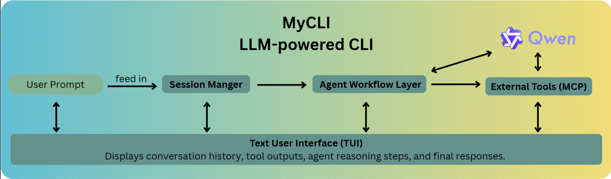
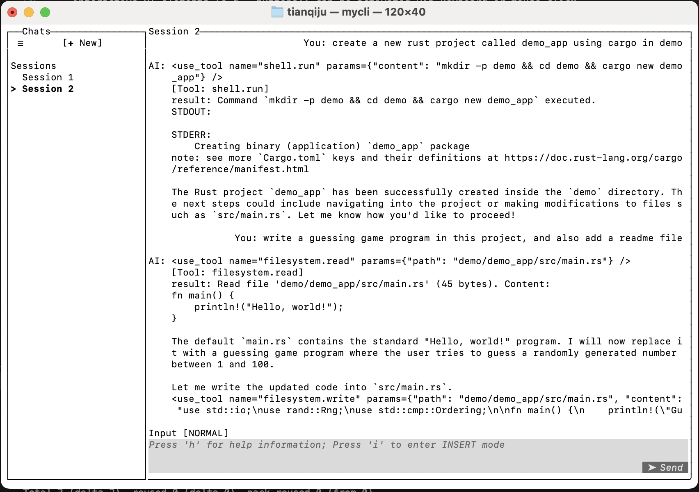

# ECE1724 Project Proposal: Simple LLM-Powered CLI

| Name       | Student Number | Preferred Email              |
|------------|----------------|------------------------------|
| Housen Zhu | 1008117477     | benjamin.zhu@mail.utoronto.ca|
| Chufan Ju  | 1011668063     | ethan.ju@mail.utoronto.ca    |
| Tianqi Ju  | 1012870467     | tianqi.ju@mail.utoronto.ca   |

---

## Motivation
Large Language Models (LLMs) are increasingly being integrated into everyday developer workflows including code generation and debugging. Also, LLMs can operate as agents on managing multi-step workflows and interacting with external tools. As one of the most widely used environments, Command-line interfaces (CLIs) are especially suitable for such integration for developers and other technical users valuing its speed and flexibility. A CLI powered by LLMs enables developers to interact with local model inference in their existing workflows with low latency.

While Python dominates the LLM tooling, it comes with some trade-offs (runtime overhead and limited guarantees of safety and concurrency). In contrast, Rust provides strong memory safety and predictable performance. However, despite these strengths, the Rust ecosystem for LLM-powered applications like a CLI remains underdeveloped in some areas.

Protocols such as the Model Context Protocol (MCP) enables LLMs to invoke external tools safely and effectively), where robust Rust integrations remain scarce. Also, CLI-based projects in Rust only offer prompt-based functionality and rarely go beyond simple REPLs (Read–Eval–Print Loop). 

By addressing these gaps, we aim to create a LLM-powered CLI that supports agentic workflows, protocol integration and context-aware sessions in Rust, enabling developers to automate tasks by using LLMs directly in their terminal without leaving their workflow. By serving with local model inference, it increases privacy and control, reduces dependence on cloud APIs or external services.

---

## Objective

The objective of this project is to design and implement a simple, Rust-based command-line interface (CLI) powered by large language models (LLMs). The system allows users to interact with language models through a text-based user interface, providing real-time streaming responses and maintaining context across multiple interactions. By organizing conversations into sessions and branches, the CLI enables structured, context-aware dialogue and flexible exploration of different interaction paths.

In addition, the project aims to support agentic workflows and external tool integration through a lightweight protocol, enabling the model to perform tasks such as file operations and shell command execution when appropriate. The overall goal is to create a lightweight, efficient, and extensible terminal-based assistant that enhances developer productivity while remaining easy to use and adaptable to future extensions.

---

## System Overview  

The system pipeline:  



---

## Features  

1. **Session Management**  
    - Maintain conversational history across multiple turns within a session.
        - Store user inputs and assistant responses in an ordered message list.
    - Organize conversations into multiple independent sessions.
        - Each session maintains its own isolated context.
        - Users can switch between sessions without losing progress.
    - Support branching conversation histories within a session.
        - Each session can contain multiple branches representing different interaction paths.
        - Branches are isolated and do not interfere with each other.
    - Allow users to fork a new branch by editing a previous user message.
        - Editing a message creates a new branch starting from that point.
    - Persist conversation logs locally for inspection and reproducibility.
        - Serialize session branches into JSON files using `serde`.    

    Session Management allows users to maintain structured and long-running conversations rather than isolated prompts. By organizing interactions into sessions and branches, users can revisit earlier inputs, explore alternative reasoning paths, and work on multiple tasks in parallel. Compared to simple Rust-based LLM CLIs, this design provides stronger context awareness and greater flexibility for complex workflows.

2. **Agentic Workflow Execution**  
   - Decompose complex user instructions into subtasks.
       - Parse LLM output as JSON plans with `serde_json`.
       - Limit to 5 steps to ensure completion.
   - Run a ReAct loop (Reason-Act-Observe) for iterative task execution.
       - Reason: LLM decides next step based on prior output.
       - Act: Execute actions like shell commands or tool calls.
       - Observe: Return results to LLM for further reasoning.
   - Safely execute shell commands and capture outputs.
       - Use `std::process::Command` in a sandbox.
   - Support automation loops for multi-step tasks.
       - Example: "Fix bugs in `main.rs`" runs analysis, edits, and tests.
   - Visualize workflow steps in the TUI or console.

    Agentic Workflow Execution can divide a task into smaller steps, call tools when needed, and repeat the process until the task is finished. In comparison, many Rust CLI tools can only work with single prompts and cannot manage complex workflows. Our system, based on ReAct, can automate tasks such as code refactoring.

3. **Tool Integration (MCP)**  
    - Implement support for the Model Context Protocol (MCP) to enable structured and safe interaction between the language model and external tools.
        - Define a set of MCP-compliant tools, including filesystem access and shell command execution.
        - Expose tools to the model through explicit, well-defined schemas rather than free-form text.

    - Support structured tool invocation through MCP.  
        - Execute tool calls as deterministic JSON-based requests.  
        - Capture tool execution results and feed them back into the model’s context for continued reasoning.

    - Display tool activity and results directly in the CLI session.  
        - Show invoked MCP tools and their outputs in the text-based user interface.  
        - Maintain transparency by allowing users to observe each action performed by the agent.

    Tool integration via MCP ensures that the CLI is not just a simple chat interface, but a flexible automation hub. Unlike typical Rust LLM CLIs that only handle prompts, our system bridges LLM reasoning with external developer tools and editors, enabling richer agentic workflows.


4. **Online Model Inference**
   - Enable model inference through online LLM APIs.
       - Send user prompts and conversation context to remote model endpoints.
       - Receive generated responses from the API.
   - Support real-time streaming of model responses.
       - Improve responsiveness and user experience during long generations.
   - Allow flexible model selection through API configuration.
       - Specify different models depending on task requirements.
   - Integrate API-based inference smoothly with session management.
       - Include session context and message history in each API request.
       - Ensure responses remain consistent with the active session.
   
   Online model inference allows the system to leverage powerful language models without requiring local model deployment. By using API-based inference, the CLI remains lightweight and easy to set up, while still supporting context-aware conversations and agentic workflows. Compared to local-only inference, this approach simplifies deployment and improves model availability at the cost of relying on external services.


5. **Text User Interface (TUI)**  
- Provide an interactive terminal-based user interface for the application.
  - Display conversation messages, user input, and system feedback in a structured layout.
  - Separate message view, input area, and optional sidebar for clarity.
  - Maintain a clean and readable interface within standard terminal constraints.

- Support modal interaction for efficient control.
  - Use Normal mode for navigation, session control, and commands.
  - Use Insert mode for typing and editing user prompts.
  - Allow seamless switching between modes to support fast workflows.

- Enable both keyboard and mouse-based interaction.
  - Support keyboard shortcuts for navigation and common actions.
  - Allow mouse clicks to select buttons, list items, and editable components.
  - Provide equivalent functionality across input methods where applicable.

- Integrate session and branch management into the UI.
  - Visually indicate the active session and branch.
  - Allow users to switch sessions and branches directly from the interface.
  - Ensure UI state stays synchronized with session and branch changes.

- Support inline message editing and interaction.
  - Allow editing of the most recent user message directly from the UI.
  - Automatically fork a new branch when submitting an edited message.
  - Preserve original conversation history while enabling exploration.

- Render model responses in real time.
  - Stream generated responses into the message view as they arrive.
  - Improve responsiveness during long generations.
  - Provide immediate visual feedback for user actions.

---

## User's Guide

This section explains how to use the main features of the deliverable through the terminal user interface (TUI). The system supports both keyboard interaction and mouse-based clicking。

### 1. Launch and Basic Navigation

After launch, the screen is divided into:
- Message area: shows conversation history (user + assistant).
- Input area: where prompts are typed (in insert mode).
- Sidebar (if enabled): session list and metadata.
- interactive UI elements (e.g., buttons): can be activated via keyboard or mouse click.



### 2. Sidebar, Help, and Exit
- Toggle sidebar:
	- Keyboard: s
	- Mouse: click the sidebar toggle
- Show help:
	- Keyboard: h
- Exit application:
	- Keyboard: q
	- Mouse: close the terminal window (sessions remain saved)

### 3. Interaction Modes

The application operates in two modes:

**Normal Mode**  
Normal mode is used for navigation and control. In this mode, users can:
- switch sessions and branches,
- activate UI controls (via keyboard or mouse),
- toggle sidebar and help views,
- initiate message editing.

The application starts in Normal mode.

**Insert Mode**  
Insert mode is used for typing or editing prompt text in the input box.

Mode switching:
- Press i → enter Insert mode
- Press Esc → return to Normal mode

### 4. Creating and Navigating Sessions

**Creating a New Session**  

A new session can be created by:
- pressing n in Normal mode,
- selecting the New Session button using Tab + Enter,
- clicking the New Session button with the mouse.

**Navigating Sessions**
- Keyboard: j / k or arrow keys('↑↓').
- Mouse: click on a session entry in the session list.

The active session is highlighted in the UI.

### 5. Entering Prompts and Receiving Responses
1.	Focus the input box (via i or mouse click).
2.	Type a prompt.
3.	Submit the prompt by:
	- pressing Enter, or
	- clicking "send" button.

Responses from the LLM are streamed and rendered in the message area.

### 6. Editing Previous Messages

To edit the most recent user message:
- Keyboard: press e in Normal mode.
- Mouse: click the Edit control displayed under the message.

Editing behavior:
- the message content is loaded into the input box,
- the application switches to Insert mode,
- submitting the edited message forks a new branch to preserve history.

### 7. Branching Conversations

Each session may contain multiple branches. Use '[' and ']' key to switch between branches.

The message view updates immediately when the active branch changes.

-----

## Reproducibility Guide 

In order to use our CLI, first clone the project repository from GitHub:
```bash
git clone https://github.com/HousenZhu/ECE1724_Project.git
cd ECE1724_Project
```

This project uses the Qwen model through the DashScope API for online inference.
For simplicity, the API key is currently defined directly in `api_key.rs`:

```bash
pub const DASHSCOPE_API_KEY: &str = "your_api_key_here";
```
In a production setting, the API key should be managed using environment variables or a secure configuration method.

Next, choose the appropriate environment directory based on your operating system:

* Windows:

```bash
cd Windows
```
On Windows, the project supports interaction with the language model through the terminal interface. The text-based user interface (TUI) is not available.

* macOS:

```bash
cd macOS
```
On macOS, the project provides a fully functional text-based user interface (TUI) along with some key GUI functionalities for enhanced interaction.

After selecting the environment, build and run the project using Cargo:

```bash
cargo build
cargo run
```
Once the program starts, users can interact with the language model directly from the terminal or TUI.
Enjoy exploring the system!


---

## Contributions 

| Task / Feature                          | Housen Zhu (MCP & Workflow) | Chufan Ju (Context & backends) | Tianqi Ju (UI) |
|-----------------------------------------|-----------------------------|-----------------------------------|----------------|
| Set up local inference with Ollama      | ✅                   |                               |                             |
| Set up local inference with Qwen3      |                        | ✅                          |                             |
| implement Rust inference backends       |                       | ✅                             |                               |
| Implement inference API for CLI         | ✅                    |                               |                             |
| Support streaming token-by-token output |                     | ✅                              |                             |
| Session context management              |                      | ✅                             |                             |
| Save/restore sessions                   |                      | ✅                             |                             |
| Branching task histories                |                      | ✅                             |                             |
| Implement agentic workflow decomposition | ✅                    |                              |                             |
| MCP protocol integration                | ✅                     |                              |                             |
| Tool discovery via MCP servers          | ✅                    |                              |                             |
| Tool invocation & result handling       | ✅                     |                              |                             |
| Build CLI with Ratatui                  |                      |                               | ✅                           |
| Input/output panes (prompts & responses)|                      |                               | ✅                           |
| Scrolling history & navigation          |                      |                               | ✅                           |
| Display session state & tool results    |                      |                               | ✅                           |
| Error handling & status messages        |                      |                               | ✅                           |
| Editing messages to fork a branch        |                      |                               | ✅                           |
| Keyboard shortcuts for context/session  |                      |                               | ✅                           |
| System integration (all modules)        | ✅                    |                               |                            |
| Testing & debugging                     | ✅                    | ✅                             | ✅                           |
| Documentation                           | ✅                    | ✅                             | ✅                           ||

---

## Lessons learned and concluding remarks
Through this project, our team gained hands-on experience building a non-trivial Rust application that combines a terminal-based user interface with a stateful backend powered by a large language model. One of the most important lessons learned was the value of clear separation of concerns. Maintaining a clean boundary between UI rendering, input handling, session management, and backend LLM execution significantly improved the system’s maintainability and made incremental feature development more manageable.

Designing a modal interaction model in a TUI environment highlighted the trade-offs between efficiency and usability. While keyboard-driven workflows enable fast interaction for experienced users, careful design and clear affordances were necessary to ensure the system remained approachable, especially when combined with optional mouse-based interaction. This reinforced the importance of aligning interface design with user expectations, even in terminal applications.

The implementation of persistent sessions and branching conversations provided insight into how conversational systems can support exploratory workflows without sacrificing reproducibility or history integrity. In particular, the decision to fork a new branch when editing previous user messages proved effective in preserving original conversation context while enabling flexible experimentation.

From a technical perspective, the project emphasized the importance of reproducibility and repository hygiene. Explicit build instructions, a clean repository structure, and proper exclusion of generated artifacts were essential to ensuring the project could be reliably built and evaluated across different environments.

In conclusion, this project successfully met its original objectives and resulted in a functional, extensible LLM-powered CLI application. The lessons learned from this work—ranging from architectural design to user interaction considerations—will directly inform our approach to future systems programming and human-computer interaction projects.
